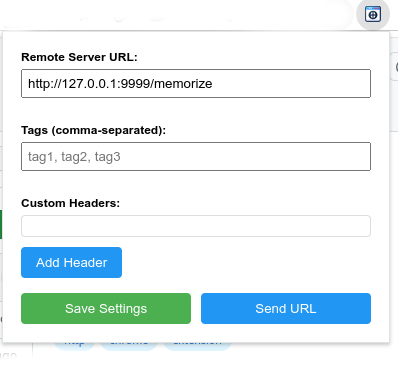

# clicPOST

clicPOST is a Chrome extension that enables you to send webpage information (URL, title, and selected text) to a remote server that processes the data through various plugins. For example, you can automatically save interesting webpages and quotes to your Obsidian daily notes, or process the data through other custom plugins.

## Features

- **One-Click Sharing**: Instantly send webpage data to your server
- **Data Capture**:
  - Page URL
  - Page Title
  - Selected text from the webpage
  - Custom metadata (planned)
- **Plugin System**:
  - Obsidian integration for daily notes
  - Extensible plugin architecture
  - Custom plugin support
- **Server Integration**:
  - Secure data transmission
  - Plugin management
  - Multiple endpoint support

## Installation

### Chrome Web Store (Coming Soon)
1. Visit the Chrome Web Store (link coming soon)
2. Click "Add to Chrome"
3. Follow the prompts to complete installation
4. Click the puzzle piece icon in Chrome's toolbar
5. Pin clicPOST by clicking the pin icon next to it
6. Configure your remote server endpoint

### Manual Installation (Developer Mode)
1. Clone this repository or download the source code
2. Open Chrome and navigate to `chrome://extensions/`
3. Enable "Developer mode" using the toggle in the top-right corner
4. Click "Load unpacked"
5. Select the directory containing the extension files
6. Click the puzzle piece icon in Chrome's toolbar
7. Pin clicPOST by clicking the pin icon next to it
8. Configure your remote server endpoint

## Usage

### Initial Setup
1. Left-click the clicPOST icon in your Chrome toolbar to open the popup
2. Enter your remote server URL in the configuration field
3. Save the settings

### Daily Use
After configuring your server URL:

You can use any server that listens on the URL you configured and handles the JSON payload described below. For a ready-to-use implementation with Obsidian integration, check out the server provided in the [surroundHome](https://github.com/lstep/surroundHome) project (currently under development).

1. Click the clicPOST icon in your Chrome toolbar while on any webpage
2. If you've selected text on the page, it will be included with the URL and title
3. The data will be sent to your configured server in JSON format:
   ```json
   {
     "url": "https://example.com/page",
     "title": "Page Title",
     "selection": "Selected text (if any)"
   }
   ```
4. The server processes the data through enabled plugins
5. For example, with the Obsidian plugin, the link and any selected quotes get added to your daily note

## Available Plugins

- **Obsidian Daily Notes**: Automatically adds links and selected text to your daily note in Obsidian. For implementation details and examples, check out the [surroundHome](https://github.com/lstep/surroundHome) project on GitHub.
- More plugins coming soon!

## Creating Custom Plugins

Documentation for creating custom plugins will be available soon. Plugins can be written to:
- Store data in different note-taking apps (see surroundHome project for Obsidian implementation example)
- Post to social media
- Archive to bookmarking services
- Any other custom processing you need

## Project Goals

1. **Simplicity**: One-click sharing of webpage data
2. **Flexibility**: Plugin system for various data processing needs
3. **Integration**: Easy connection with different note-taking and productivity tools
4. **Security**: Secure transmission of data to your server
5. **Extensibility**: Simple plugin development for custom needs

## Screenshots

### Extension Popup


*The main popup interface showing the server URL configuration and current page data*

### Obsidian Integration


*How the captured data appears in your Obsidian daily notes*

## Contributing

Contributions are welcome! Please feel free to submit pull requests, create issues, or suggest new features.

## License

This project is licensed under the GNU General Public License v3.0 - see the [LICENSE](LICENSE) file for details. This means you can freely use, modify, and distribute this software, but any derivative work must also be licensed under the GPL v3.


## Badges

[](https://opensource.org/licenses/)


## Author

Created and maintained by lstep.
